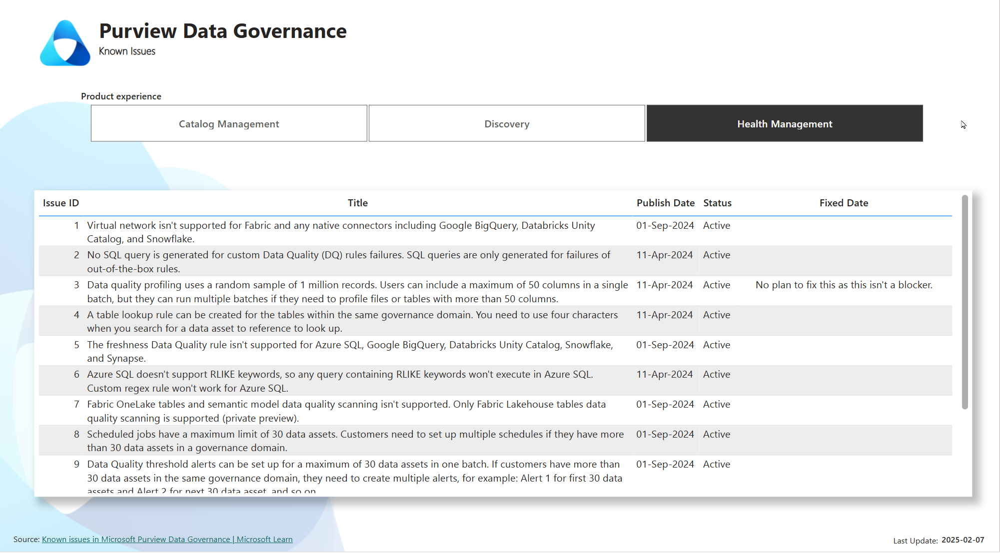
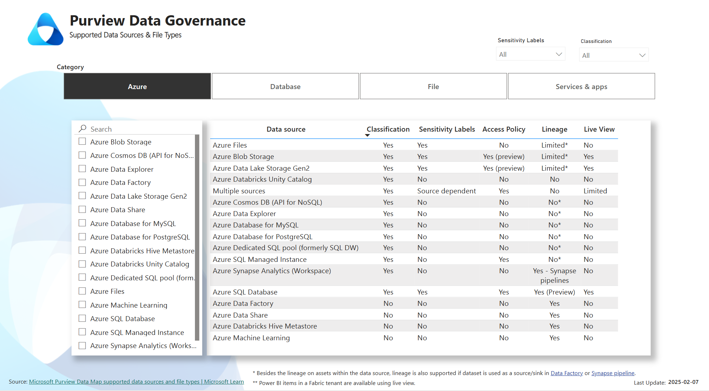

# Microsoft Purview Data Governance

## Overview  
This repository contains a **Power BI report** that provides insights into **Microsoft Purview Data Governance**, including:  

- 🛠 **Known Issues**: Track reported issues affecting Microsoft Purview.
  -  
- 🔗 **Supported Data Sources**: View and analyze data sources that integrate with the **Purview Data Map**.  
  -  
This report helps users stay informed about **current limitations, updates, and compatibility** within Microsoft Purview.  

## Features  
- 📊 **Interactive Power BI report**  
- ✅ **Up-to-date known issues** from Microsoft Purview  
- 🔍 **Comprehensive list of supported data sources**  

## Data Sources
- [Data governance known issues](https://learn.microsoft.com/en-us/purview/data-governance-known-issues)
- [Data sources that connect to Data Map](https://learn.microsoft.com/en-us/purview/microsoft-purview-connector-overview)

Reports are updated periodically to reflect the latest known issues and supported data sources.

## Contributing
Contributions are welcome! If you have updates or new insights, feel free to submit a pull request.

## How to Use  
1. **Clone the Repository**:  
   ```sh
   git clone https://github.com/ievsantillan/msft-pview-dg.git
1. **Browse to src**
   ```sh
   \msft-pview-dg\src
1. **Open `Purview Data Governance.pbix`** refresh and publish the report to the Power BI Service.
1. (Optional) Set up your On-Premise Data Gateway [(OPDG)](https://learn.microsoft.com/en-us/data-integration/gateway/service-gateway-install) to schedule your refresh. 

   
